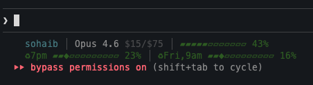

# Claude Code Statusline

A custom status line for [Claude Code](https://docs.anthropic.com/en/docs/claude-code) that shows **real usage limits** from the Anthropic API with visual progress bars.



## What it shows

**Line 1:** Directory | Git branch | Model name + input/output pricing per 1M tokens | Context window bar

**Line 2:** 5-hour rolling usage bar with reset time | 7-day usage bar with reset time

- `▰▱` progress bars with color coding (green < 50%, yellow 50-80%, red > 80%)
- `◆` pacing marker shows where usage *should* be for even distribution across the window
- `♻` followed by the reset time for each window

## Requirements

- macOS (uses Keychain for OAuth credentials)
- [Claude Code](https://docs.anthropic.com/en/docs/claude-code) CLI
- `jq` and `curl`

## Install

1. Copy the script to your Claude config directory:

```bash
cp statusline.sh ~/.claude/statusline.sh
chmod +x ~/.claude/statusline.sh
```

2. Add to your `~/.claude/settings.json`:

```json
{
  "statusLine": {
    "type": "command",
    "command": "~/.claude/statusline.sh",
    "padding": 2
  }
}
```

3. Restart Claude Code. The status line appears automatically.

## How it works

The script reads the JSON context that Claude Code pipes to status line commands, then fetches your actual usage data from the Anthropic OAuth API (`https://api.anthropic.com/api/oauth/usage`). Results are cached for 60 seconds to avoid excessive API calls.

The OAuth token is read from your macOS Keychain (stored by Claude Code when you log in).

## Model pricing

The status line shows input/output token costs per 1M tokens for the active model:

| Model | Displayed |
|-------|-----------|
| Opus 4.6 | `$15/$75` |
| Sonnet 4.6 | `$3/$15` |
| Haiku 4.5 | `$0.8/$4` |

## Credits

Based on [jtbr's statusline gist](https://gist.github.com/jtbr/4f99671d1cee06b44106456958caba8b).

## License

MIT
