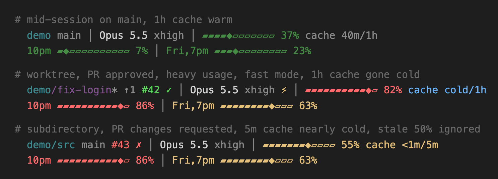

# Claude Code Statusline

A two-line status line for [Claude Code](https://code.claude.com/docs/en/statusline): where you are (repo, worktree, branch, PR), which model and effort, how full the context is, and how much of your 5-hour and weekly limits you've used.



## What it shows

**Line 1:** `repo[/worktree][/subdir] branch* ↑ahead ↓behind #PR │ model effort ⚡ │ context bar`

- The repo is named after its folder. Inside a linked worktree (e.g. `.claude/worktrees/fix-login`) the worktree name follows in magenta, and the branch is left out when it's just the worktree's own (`fix-login` or `worktree-fix-login`).
- `*` uncommitted changes to tracked files; `↑`/`↓` commits ahead of / behind upstream.
- `#42` is the open PR for the branch: green `✓` approved, red `✗` changes requested, yellow awaiting review, dim `draft`. Cmd-click opens it (iTerm2, Kitty, WezTerm).
- Effort level as set by `/effort`; `⚡` in fast mode.
- Context window bar, then the prompt cache: `cache 42m/1h` is minutes left out of its lifetime (Claude Code uses either a 5-minute or a 1-hour cache). It turns yellow in the last fifth of the lifetime and becomes `cache cold/1h` once expired, meaning the next message re-processes the whole context. That costs about 12–20× a warm message's input, once.

**Line 2:** 5-hour usage bar with the hour it resets │ weekly usage bar with the day and hour it resets.

Bars: `▰` used, `▱` remaining, `◆` fill edge. Green below 50%, yellow 50–80%, red from 80%.

## Requirements

- macOS (uses BSD `date -r`)
- Claude Code with a Pro or Max plan (the usage line needs `rate_limits` in the status line input)
- `jq`, and git 2.31+

## Install

```bash
git clone https://github.com/skcadri/claude-statusline ~/code/claude-statusline
ln -sf ~/code/claude-statusline/statusline.sh ~/.claude/statusline.sh
```

Then in `~/.claude/settings.json`:

```json
{
  "statusLine": {
    "type": "command",
    "command": "~/.claude/statusline.sh",
    "padding": 2,
    "refreshInterval": 30
  }
}
```

`refreshInterval` redraws the line every 30 seconds so the cache countdown ticks while you're idle. Because the script is a symlink, `git pull` updates the status line in every running session.

## Preview

```bash
./preview.sh
```

Renders every state (new session, mid-session, worktree with PR, cold cache, heavy usage, outside git) against a throwaway git repo. No Claude Code session needed, and your real usage cache isn't touched.

## How it works

Claude Code pipes [session JSON](https://code.claude.com/docs/en/statusline#available-data) to the script on every refresh. The script reads it with one `jq` call and runs two fast git commands (`rev-parse`, then `status --no-optional-locks` so it never fights a background agent for `index.lock`). There are no network calls and no OAuth token handling.

Usage numbers come from the `rate_limits` field, which Claude Code only includes after a session's first API response. So each session merges what it sees into `/tmp/claude-statusline-limits.json`, and a fresh or `/clear`ed session reads from there. Usage only grows within a window, so the higher number wins, and windows past their reset time are dropped.

## Credits

Based on [jtbr's statusline gist](https://gist.github.com/jtbr/4f99671d1cee06b44106456958caba8b).

## License

MIT
